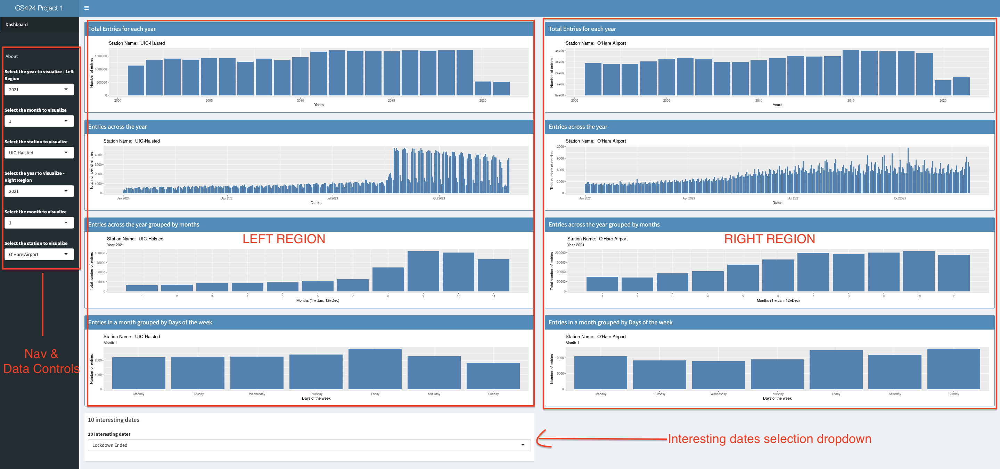

CS 424 - Project Page
Gautam Kushwah


# Important Links

[Link to Shiny App for Project 1](https://gautam-kushwah.shinyapps.io/424project1/)

### Resources
[link to Video Walkthrough](https://www.youtube.com/)

There should be whitespace between paragraphs.

There should be whitespace between paragraphs. We recommend including a README, or a file with information about your project.

# Introduction

This is an app made using R studio and Shiny, the links to which have been provided above.

### What is R?

R is a programming language for statistical computing and graphics supported by the R Core Team and the R Foundation for Statistical Computing


### What is Shiny?

Shiny is an R package that makes it easy to build interactive web apps straight from R. You can host standalone apps on a webpage or embed them in R Markdown documents or build dashboards


### Purpose of this App

The purpose of this app is to use the data provided on riders on the Chicago L over the past 20 years and use shiny to give people an interactive interface to create those visualizations. The app provides various data visualizations in the form of bar graphs breaking down data across all years, individual years, months, and even days in a week over a month.

It shows interesting trends and helps understand the user the behavior of the riders on the Chicago which in turn could be explained by various events occurring at the same time.

The app could also help find interesting dates in the last 20 years which might have affected the behavior of the riders and thus help us understand the power of data and data visualization.

### How to use the App?

You can head over to the app here. Upon opening the app, you would be greeted with a Shiny dashboard which would give you various bar charts. 

The screen in divided into 3 parts:
1. The Side Bar: This has navigation controls and data input controls for the charts on right hand side of the screen
2. Left Region: This shows various bar charts for station one, which by default is UIC-Halsted.
3. Right Region: This shows various bar charts for station two, which by default is O’Hare Airport.

[!Link to image if not rendered](https://drive.google.com/file/d/15a20v0eG29fKueH79qzyFh6lcrEeDG6G/view?usp=sharing)


The user can compare the same station on both sides across different times using the dropdown menus in the side bar


# About the Data


The data was obtained from Chicago Data portal, the link to the data could be found [here](https://data.cityofchicago.org/Transportation/CTA-Ridership-L-Station-Entries-Daily-Totals/5neh-572f)

This list shows daily totals of ridership, by station entry, for each 'L' station dating back to 2001. Dataset shows entries at all turnstiles, combined, for each station.

The data consists of 5 columns and about 1.09 million rows.

The columns are as follows
**station_id** - Unique ID for a station
**stationname** - The name of the station
**date** - The date of the entries
**daytype** - W=Weekday, A=Saturday, U=Sunday/Holiday
**rides** - total number of ridership on that date


The date was provided in a chr format, therefore it had to be converted into a usable format which was achieved through a R library called **lubridate**

The data was downloaded in tsv format, since the free version of Shiny allows us to only work with files which are <5 mb, I used shell script to break it down into smaller files using shell and the following command

```
split -b <size in kb> <filename> <name of parts>
```

The <name of parts> signifies what the broken down files would be named.


I then used a code editor to verify if the files were broken down correctly, and upon verifying that I loaded the filenames in a list in R and then stitched them together into a single table, hence being able to work with all the rows.


The next step included breaking down the entire dataset into three individual data sets, each based on the stations I was interested in. For this project, I used three stations namely : **UIC-Halsted**, **O’Hare Airport** and one closest to which I live i.e **Polk**.

Each dataset had to grouped by three criterias:
1. Years
2. Months in that year
3. Days in that Month

Each of which was done dynamically using the choices provided by the user using reactive elements in R.
I used the library **dplyr** for chaining/piping commands and R commands such as “subset” and “group_by” to get the subset of data based on the station and then group that data based on days, months or years, respectively.


# Github


The github repo for the source code could be found below
[Github Repo CS424](https://github.com/gautam-kushwah/cs424)

The source code is the file called **app.R**, with all the broken uptsv files named from partaa.tsv to partah.tsv

To run the code you would need to download and install R and R-Studio the links to which could be found [!here](https://repo.miserver.it.umich.edu/cran/) and [here](https://rstudio.com/products/rstudio/download/) respectively 

Either clone or download the zip file from the repo and unzip it on your machine in your preferred location.
Now to run the app follow these steps:

1 Open R-studio
2 Click on File->New Project
3 Choose existing directory from the pop-up window
4 Now select the directory where you have downloaded the project
5 Follow the on screen instruction

Once the project has been created/opened go to app.R from the navigation tab on the bottom right of the IDE
Then in the file editor window on the top left, you would find a run app button, alternatively you could also use the R console and type in the command “runApp()”

The app would be launched in a separate window.

You could also open it in your web-browser by clicking on “open in web browser” button in the app window

To refer to the instructions on how to use and interact with app, please read the **How to Use the App** section above


# Observation and Inferences 
  
CS424


Github

Using the shiny app interface and seeing anomalies and searching those dates on the internet or using my knowledge of current affairs of the world at the time I was able to find “Ten Interesting Dates” in the dataset

Those are

#### 1 Lockdown Ended

This one was the most obvious as we can see the trends in 2021, especially after July 2021, when normal functioning of the society resumed and people started returning to their work. This was also around the same time when the US government opened borders for international student and people of national interest.

#### 2 Covid-19

I think this is one of the biggest events of my generation’s lifetime, which is pretty evident from the sharp decline in the number of ridership starting January  2020, and then an even sharper decline in March 2020 onwards. This is where most nations across the world starting imposing nationwide lockdowns

#### 3 CTA Blue line Shutdown

As can be seen in the data for O’Hare Airport station the number of rides are very less in some particular days in September - October 2019. Naturally I was intrigued so I ran a quick search on the internet about the events of 2019. A found a [news article](https://chicago.curbed.com/2019/9/27/20887180/cta-blue-line-ohare-rosemont-shutdown-construction) which details shutdown ofg the O’Hare station due to construction of a new route

#### 4 Summer Break

This event is more evident on the UIC-Halsted station as this is the one most used by the students for their saily commute. Also, this pattern is evident across years (apart from COVID lockdowns) I have arbitrary chosen 2017 to demonstrate this trend.

#### 5 September 11 attacks

This one was one of the saddest events in our history. Which is pretty evident by the data but upon closer look you could also uncover the resilience of the people of the United States as things bounced back to normal within a short span of time in terms of ridership.

#### 6 CTA ridership grows

If you look at the ridership data across the last 20 years, the upwards growing trend starting from 2010 onwards and continuing through the next few years is very evident.
A quick internet search also reveals that the ridership was highest in two decades in 2011, a link to the relevant article could be found [here](https://www.transitchicago.com/2011-cta-ridership-reaches-highest-level-in-two-decades/)

#### 7 CTA derailment

I noticed a sudden dip in rides in january 2007, although I found an article I am not entirely sure if the two are related. The link to the article is [here](https://www.chicagotribune.com/news/ct-xpm-2007-01-19-0701190114-story.html)

#### 8 Fall session starts

This one is pertaining to UIC-Halsted as is evident across years. Again I arbitrarily chose a year.

#### 9 Crash at O'Hare Blue line

If you notice the ridership at O’Hare station for the year 2014, the ridership dips suddenly around march-april. If you do a quick internet set for the major events of 2014 in chicago, a link to a [wikipedia article](https://en.wikipedia.org/wiki/O%27Hare_station_train_crash) pops up, detailing the crash

#### 10 Lollapalooza Music Festival

The lollapalooza Festival which took place in 2011 in Grant Park was one of the biggest music festivals. I found it by looking at the unusually high number of ridership around july end - aug starting


